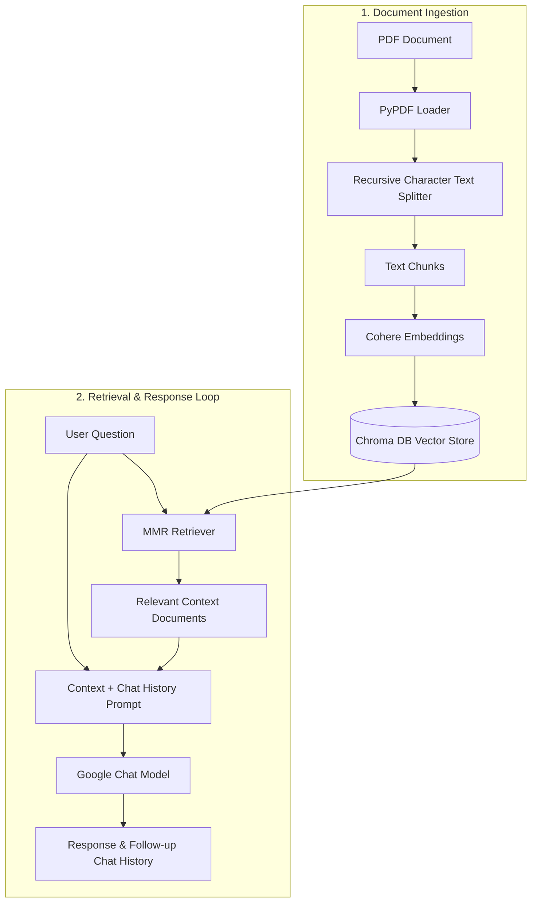

# RAG Book Assistant

A Retrieval-Augmented Generation (RAG) application designed to help you interactively search, analyze, and query PDF books, academic papers, and documents. Built using LangChain, Google chat models, Cohere embeddings, and Chroma DB.

The project features both a terminal-based conversational interface and an interactive Streamlit Web Application.

---

## Features

- **Interactive Streamlit Web UI**: Easy PDF document uploader, automated vector database ingestion, and real-time chat.
- **Fast CLI Interface**: Console-based chat loop with full chat history preservation for quick local query testing.
- **Advanced Retrieval**: Employs Maximal Marginal Relevance (MMR) search to balance relevance and diversity of retrieved document sections.
- **Context-Bound Answering**: Strict system prompting prevents hallucination, instructing the assistant to answer questions only if the answer is present in the context of the document.
- **Multi-Query Expansion**: Multi-query retrieval demonstration to rewrite user questions from different perspectives for more robust document retrieval.

---

## Architecture Workflow



---

## Getting Started

### Prerequisites

Ensure you have the following installed on your local machine:
- Python 3.9 - 3.11
- Git
- API Keys for:
  - Google Generative AI (for the chat model)
  - Cohere (for embeddings)
  - Mistral AI (optional, for CLI testing scripts)

---

### Installation & Setup

1. **Clone the repository:**
   ```bash
   git clone <your-repository-url>
   cd RAG_PROJECT
   ```

2. **Set up a Virtual Environment:**
   ```bash
   # Create a virtual environment
   python -m venv .venv

   # Activate it (Windows)
   .venv\Scripts\activate

   # Activate it (Mac/Linux)
   source .venv/bin/activate
   ```

3. **Install Dependencies:**
   ```bash
   pip install -r requirements.txt
   ```

4. **Configure Environment Variables:**
   Create a file named `.env` in the root directory and add your API keys:
   ```env
   GOOGLE_API_KEY="your-google-api-key"
   COHERE_API_KEY="your-cohere-api-key"
   MISTRAL_API_KEY="your-mistral-api-key"
   ```

---

## How to Run

### Option 1: Streamlit Web UI (Recommended)
Launch the interactive web application to upload files and chat using a browser dashboard:
```bash
streamlit run app.py
```
- Open your browser at `http://localhost:8501`.
- Upload your PDF document.
- Click **"Create Vector Database"** to process the document.
- Start asking questions in the chat!

### Option 2: CLI Chat
If you already have a PDF processed or want to query the database from your terminal:
1. **Index a Document**: Open `create_database.py` and verify your PDF target, then run:
   ```bash
   python create_database.py
   ```
2. **Start the Chat Loop**: Run the main CLI loop:
   ```bash
   python main.py
   ```
   - Type your question and press **Enter**.
   - Type `0` (zero) to exit the program.

---

## Repository Structure

```text
├── chroma_db/               # Local persistence directory for Chroma vector store (gitignored)
├── documentloaders/         # PDF loaders and testing helper scripts
│   ├── deeplearning.pdf     # Example PDF document
│   └── GRU.pdf
├── vector stores/           # Extra scripts testing vector store search strategies
│   └── DB.py                # Multi-query & MMR retrieval demonstration
├── .env                     # Local environment keys & configurations (gitignored)
├── .gitignore               # Excludes secrets, caches, and venv files from Git
├── app.py                   # Main Streamlit web application
├── create_database.py       # Local PDF processing and embedding population script
├── main.py                  # Main CLI chatbot application
└── requirements.txt         # Project dependencies
```

---

## Built With

- **[LangChain](https://github.com/langchain-ai/langchain)** - Core LLM application orchestration framework.
- **[Streamlit](https://streamlit.io/)** - Rapid GUI development for machine learning applications.
- **[Chroma DB](https://www.trychroma.com/)** - Open-source vector database for AI.
- **[Cohere](https://cohere.com/)** - Embeddings for contextual text representation.
- **[Google Chat Model](https://ai.google.dev/)** - LLM for response generation.

---

## Security Warning

> [!WARNING]
> Do not commit or push the `.env` file containing your API keys to public repositories. This repository is pre-configured with a `.gitignore` to prevent secret leaks.
